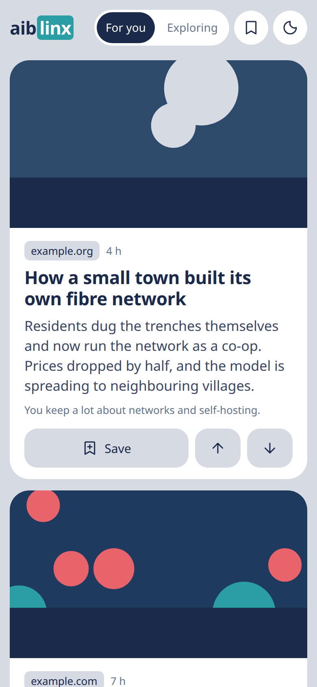
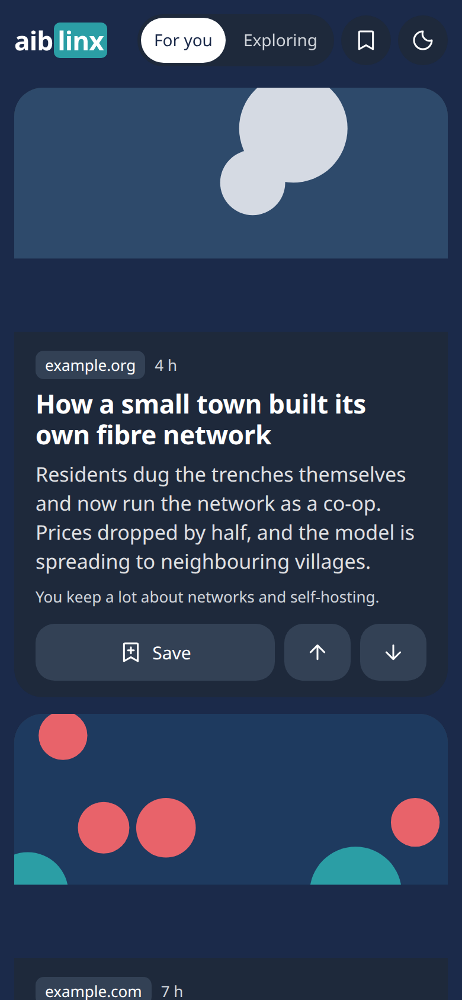

# aiblinx

**A private Discover feed that learns from what you keep.**

aiblinx is a self-hosted news feed for your phone. It learns what you care
about from the pages you keep — browser bookmarks, [Linkwarden](https://linkwarden.app)
bookmarks, stories you save or upvote — and every morning puts about thirty
fresh stories in front of you: title image, a few sentences to decide whether
it's worth your time, and one line on why it was picked.

No ads, no engagement tricks, no account at a big platform. It runs on your
own server, and your reading profile is one SQLite file.

<p align="center">
  
  &nbsp;
  
</p>
<p align="center"><sub>Screenshots with demo data.</sub></p>

## What it does

- **Learns from a few buttons.** *Save* (to aiblinx, or to Linkwarden when
  connected), *more like this* and *less like this*. No rating scales. Recent
  taps count more, and your profile follows you as your interests change.
- **Reads without leaving.** A story opens in a clean reader view, and a video
  plays right there. Nothing about what you open is recorded, and publishers
  never see where you came from.
- **Keeps a window open.** An *Exploring* section reserves 30% of the feed for
  topics outside your profile. What you save or vote there teaches Exploring
  which distractions you like, without changing your main feed, and Exploring
  saves get their own Linkwarden collection. *Promote* moves a story into your
  main interests; the compass sends a main-feed story to Exploring.
- **Finds your sources itself.** It looks at the sites you keep and subscribes
  to their feeds, and adds Hacker News. The setup page lists every feed, so
  you can unsubscribe or add a site. Optional: a
  [Miniflux](https://miniflux.app) reader, and [SearXNG](https://docs.searxng.org)
  searches on topics you pick.
- **Explains itself.** Every card says why it was picked.
- **Feels like an app.** Mobile-first, light and dark, and *Add to Home Screen*
  opens it full screen. Also available as an Atom feed and a daily digest.

## Quick start (about 5 minutes)

You need Docker and an [OpenRouter](https://openrouter.ai/keys) API key
(sign-up with email or GitHub; no phone number).

```bash
git clone https://github.com/aibix0001/aiblinx.git && cd aiblinx
cp .env.example .env
# edit .env: set OPENROUTER_API_KEY=sk-or-...
docker compose up -d
```

Open <http://localhost:8000/setup>, import your browser's bookmarks (every
browser can export them as an HTML file) or paste a few links you liked, and
press **Build my feed**. A minute later your feed is at
<http://localhost:8000/ui>. It refreshes every morning at 06:00 UTC.

**What it costs:** with the OpenRouter preset, embeddings use a free model and
the chat model that ranks and explains costs about **5 cents a month**. Set
`LLM_RERANK=false` for a completely free setup (no "why" line). Note that free
OpenRouter models may keep or train on the text they are sent.

## Optional parts

Everything beyond the one container is opt-in. Add profiles to
`COMPOSE_PROFILES` in `.env`:

| Profile | What you get | Also set |
|---|---|---|
| `searxng` | The *Exploring* section, from private meta-search on topics you pick | `SEARXNG_URL=http://searxng:8080`, `SEARXNG_SECRET` (`openssl rand -hex 32`) |
| `miniflux` | A full RSS reader app for the feeds aiblinx subscribes to (otherwise it reads them itself) | `MF_DB_PASSWORD`, `MF_ADMIN_USER`, `MF_ADMIN_PASSWORD` (the API key is created for you) |
| `ollama` | Local AI models instead of a hosted API | preset C in `.env.example`, then `docker compose exec ollama ollama pull bge-m3` |

**Linkwarden** is optional too: set `LINKWARDEN_BASE_URL` and
`LINKWARDEN_TOKEN`, and your bookmarks shape the feed from day one while saves
go straight into Linkwarden. Connect it later and saves made before move over
automatically. Run Linkwarden with [its own setup](https://docs.linkwarden.app).

## AI models

aiblinx talks to any OpenAI-compatible API. `.env.example` has ready blocks
for **OpenRouter** (recommended without your own GPU), **Ollama** (fully
local), **NVIDIA NIM**, and any other server (vLLM, llama.cpp, LocalAI).

You can switch presets later. When the embedding model changes, aiblinx backs
up its database and re-computes every vector from the text it keeps over the
next cycle; your saves, imports and votes stay.

## Security

The feed is open by default, like most home-network services. If it is
reachable from the internet, set `APP_PASSWORD` (each device logs in once; reader
apps get a secret feed URL on the setup page) and `ADMIN_TOKEN` (protects the
endpoint that triggers model runs). See [SECURITY.md](SECURITY.md).

## How it works

A small FastAPI app with a daily cycle: mirror bookmarks → find and subscribe
feeds → collect stories → cluster your kept pages into interests → rank by
similarity, let the model re-rank and explain the top 50, diversify → fill the
Exploring slots → fetch title images → publish. Details, settings and data
model: [docs/architecture.md](docs/architecture.md).

## Contributing

Issues and pull requests are welcome; see [CONTRIBUTING.md](CONTRIBUTING.md).

## License

[Apache-2.0](LICENSE)
